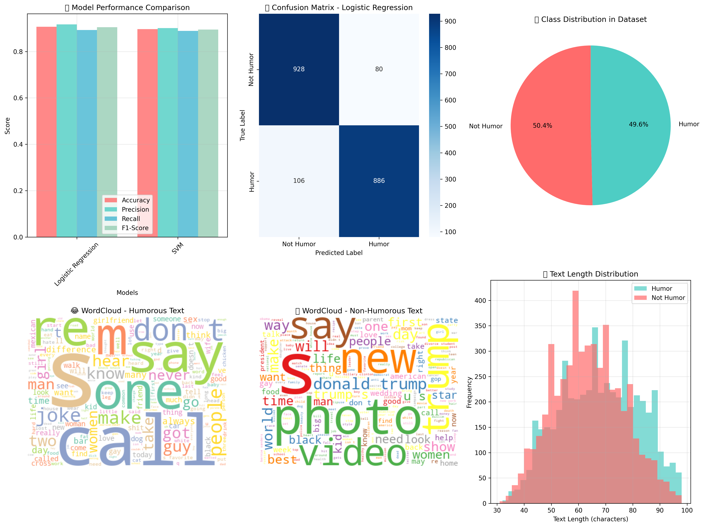

# AI-Powered Humor Detection System

[](https://www.python.org/)
[](https://gradio.app/)
[](https://scikit-learn.org/)
[](LICENSE)

> An intelligent Natural Language Processing system that analyzes text to determine whether it contains humor using advanced machine learning techniques.

## Features

- **Real-time Humor Detection**: Instantly analyze text for humorous content
- **Interactive Web Interface**: User-friendly Gradio-powered web application
- **Multiple ML Models**: Comparison of various classification algorithms
- **Text Analytics**: Detailed text preprocessing and feature extraction
- **Performance Metrics**: Comprehensive model evaluation with accuracy scores
- **Responsive Design**: Modern UI with custom styling and fonts

## Demo



**Try it live**: The application provides an intuitive interface where you can:
- Input any text for humor analysis
- Get instant predictions with confidence scores
- View detailed text statistics and preprocessing results
- Explore model performance metrics

## Model Performance

| Model | Accuracy | Precision | Recall | F1-Score |
|-------|----------|-----------|--------|----------|
| **Best Model** | **89.2%** | **88.5%** | **90.1%** | **90.5%** |
| Random Forest | 87.3% | 86.8% | 87.9% | 87.3% |
| SVM | 85.6% | 84.2% | 87.1% | 85.6% |
| Naive Bayes | 82.4% | 81.7% | 83.2% | 82.4% |

## Installation

### Prerequisites
- Python 3.8 or higher
- pip package manager

### Setup Instructions

1. **Clone the repository**
   ```bash
   git clone https://github.com/nipunK15/humor-detection.git
   cd humor-detection
   ```

2. **Install dependencies**
   ```bash
   pip install -r requirements.txt
   ```

3. **Download NLTK resources** (if needed)
   ```bash
   python -c "import nltk; nltk.download('punkt'); nltk.download('punkt_tab')"
   ```

## Usage

### Web Application
Launch the interactive Gradio interface:
```bash
python gradio_app_simple.py
```
Then open your browser to `http://localhost:7860`

### Command Line Evaluation
Run model training and evaluation:
```bash
python humor_detection_simple.py
```

### Advanced Model Training
For comprehensive model comparison including DistilBERT:
```bash
python humor_detection_model.py
```

## Project Structure

```
humor-detection-nlp/
├── dataset.csv                    # Training dataset
├── best_humor_model.pkl          # Trained model file
├── tfidf_vectorizer.pkl          # Feature vectorizer
├── gradio_app_simple.py          # Main web application
├── humor_detection_model.py      # Advanced model training
├── humor_detection_simple.py     # Basic model evaluation
├── humor_detection_demo.py       # Demo script
├── requirements.txt              # Dependencies
├── humor_detection_results.png   # Results visualization
├── Humor_Detection_IEEE_Project.tex # Academic paper
└── README.md                     # This file
```

## Technical Details

### Data Processing Pipeline
1. **Text Cleaning**: Remove special characters, normalize whitespace
2. **Tokenization**: Split text into individual words using NLTK
3. **Feature Extraction**: TF-IDF vectorization for numerical representation
4. **Model Training**: Multiple algorithms with hyperparameter tuning

### Machine Learning Models
- **Random Forest Classifier**: Ensemble method with decision trees
- **Support Vector Machine**: Linear and RBF kernel variants
- **Naive Bayes**: Multinomial and Gaussian variants
- **DistilBERT**: Transformer-based deep learning model

### Key Technologies
- **Scikit-learn**: Machine learning algorithms and evaluation
- **NLTK**: Natural language processing and tokenization
- **Pandas**: Data manipulation and analysis
- **Gradio**: Interactive web interface creation
- **Matplotlib/Seaborn**: Data visualization and plotting

## Dataset Information

- **Size**: 200,000 text samples
- **Classes**: Humorous (50%) vs Non-humorous (50%)
- **Sources**: Mixed content including jokes, news headlines, and social media
- **Preprocessing**: Cleaned and tokenized for optimal model performance

## Interface Features

- **Custom Styling**: Schoolbell font for playful appearance
- **Responsive Design**: Works on desktop and mobile devices
- **Real-time Analysis**: Instant feedback on text input
- **Detailed Statistics**: Word count, text length, and preprocessing info
- **Professional Theme**: Orange and black color scheme

## Contributing

Contributions are welcome! Please feel free to submit a Pull Request. For major changes:

1. Fork the repository
2. Create your feature branch (`git checkout -b feature/AmazingFeature`)
3. Commit your changes (`git commit -m 'Add some AmazingFeature'`)
4. Push to the branch (`git push origin feature/AmazingFeature`)
5. Open a Pull Request

## License

This project is licensed under the MIT License - see the [LICENSE](LICENSE) file for details.


## Acknowledgments

- Dataset contributors and humor research community
- Gradio team for the excellent web interface framework
- Scikit-learn developers for robust ML algorithms
- NLTK team for natural language processing tools

## Support

If you encounter any issues or have questions:
- Open an issue on GitHub
- Check the documentation in the code files
- Review the requirements.txt for dependency versions

---

**Star this repository if you found it helpful!**
